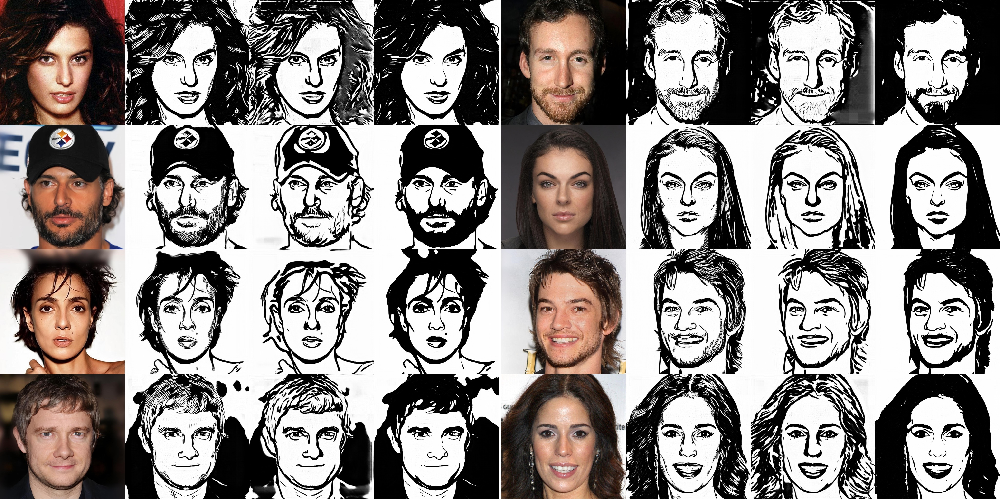

# Unpaired Portrait Drawing Jittor Implementation

We provide [Jittor](https://github.com/Jittor/jittor) implementations for our CVPR 2020 paper "Unpaired Portrait Drawing Generation via Asymmetric Cycle Mapping". [paper](https://openaccess.thecvf.com/content_CVPR_2020/papers/Yi_Unpaired_Portrait_Drawing_Generation_via_Asymmetric_Cycle_Mapping_CVPR_2020_paper.pdf), [suppl](https://openaccess.thecvf.com/content_CVPR_2020/supplemental/Yi_Unpaired_Portrait_Drawing_CVPR_2020_supplemental.pdf).

This project generates multi-style artistic portrait drawings from face photos using a GAN-based model.

## Prerequisites
- Linux or macOS
- Python 3
- CPU or NVIDIA GPU + CUDA CuDNN

## Sample Results
From left to right: input, output(style1), output(style2), output(style3)


## Installation
- To install the dependencies, run
```bash
pip install -r requirements.txt
```

## Apply pretrained model

- 1. Download pre-trained models from [BaiduYun](https://pan.baidu.com/s/1_9Fy8mRpTQp6AvqhHsfQAQ)(extract code:c9h7) or [GoogleDrive](https://drive.google.com/drive/folders/1FzOcdlMYhvK_nyLCe8wnwotMphhIoiYt?usp=sharing) and rename the folder to `checkpoints`.

- 2. Test for example photos: generate artistic portrait drawings for example photos in the folder `./samples` using
``` bash
python test.py --input_folder ./samples
```
Results are saved in `./results/portrait_drawing/pretrained_200`

- 3. To test on your own photos: First use an image editor to crop the face region of your photo (or use an optional preprocess [here](preprocess/readme.md)). Then specify the folder that contains test photos using option `--input_folder`, and run the `test.py` again.

## Train

- 1. Prepare for the dataset: 1) download face photos and portrait drawings from internet (e.g. [resources](portrait_drawing_resources.md)). 2) align, crop photos and drawings & 3) prepare nose, eyes, lips masks according to [preprocess instructions](preprocess/readme.md). 3) put aligned photos under `./data/portrait_drawing/train/A`, aligned drawings under `./data/portrait_drawing/train/B`, masks under `A_nose`,`A_eyes`,`A_lips`,`B_nose`,`B_eyes`,`B_lips` respectively.

- 2. Train a 3-class style classifier and extract the 3-dim style feature (according to paper). And save the style feature of each drawing in the training set in .npy format, in folder `./data/portrait_drawing/train/B_feat`

A subset of our training set is [here](https://drive.google.com/file/d/1OSMOR3-uhGkoPwPFRNychJSNrpSak_23/view?usp=sharing).

- 3. Train our model (200 epochs)
``` bash
python asymmetric_cyclegan.py
```
Models are saved in folder `checkpoints/portrait_drawing`

- 4. Test the trained model
``` bash
python test.py --which_epoch 200 --model_name portrait_drawing
```
Results are saved in `./results/portrait_drawing/portrait_drawing_200`

## Citation
If you use this code for your research, please cite our paper.

```
@inproceedings{YiLLR20,
  title     = {Unpaired Portrait Drawing Generation via Asymmetric Cycle Mapping},
  author    = {Yi, Ran and Liu, Yong-Jin and Lai, Yu-Kun and Rosin, Paul L},
  booktitle = {{IEEE} Conference on Computer Vision and Pattern Recognition (CVPR '20)},
  pages     = {8214--8222},
  year      = {2020}
}
```